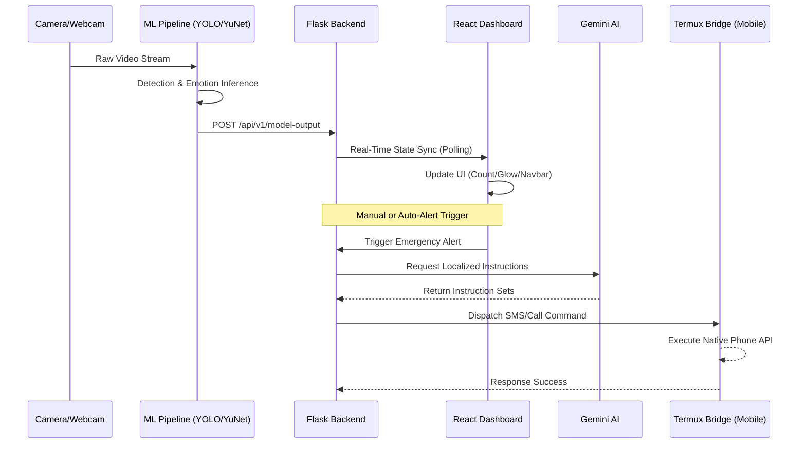

# System Architecture: CrowdShield

This document provides a technical deep-dive into the architectural layers and data flow of the CrowdShield platform.

---

## 🔄 System Workflow

The following diagram illustrates the journey of data from the edge (camera sensors) to the command center (dashboard) and finally to the field (emergency response via mobile).



---

## 🏗️ Architectural Layers

### 1. Perception Layer (Edge Processing)
*   **Technologies**: OpenCV, YOLOv8, YuNet.
- **Function**: Processes raw footage at the source. It extracts human counts, identifies high-density clusters, and maps facial landmarks to a 7-class emotion model.
*   **Sync Mechanism**: Encodes processed frames as base64 JPEG strings for "Shadow Streaming"—allowing low-latency visual feedback in the dashboard grid.

### 2. Orchestration Layer (State Management)
*   **Technologies**: Python (Flask), Global State Store.
- **Function**: Acts as the "Brain" of the system. It maintains a consistent world view (system health, camera stats, active incidents) and serves this via a RESTful API.
*   **Alert Engine**: Evaluates incoming counts against safety thresholds. If thresholds are breached, it manages the duplication-prevented alert logs.

### 3. Presentation Layer (Unified Dashboard)
*   **Technologies**: React, Vite, Framer Motion.
- **Function**: A high-performance, responsive interface for security operators.
*   **State Transitions**: Uses a tri-state header (Success/Warning/Critical) and cinematic overlays (Amber/Red demos) to provide clear situational awareness.

### 4. Transmission Layer (Communication Bridge)
*   **Technologies**: Termux API, GSM Gateway.
- **Function**: Interfaces with physical telecommunications. 
*   **Termux Bridge**: A custom Python bridge running natively on Android, allowing the PC-based dashboard to "borrow" the phone's SMS and Voice capabilities.

---

## 📂 Project Structure

```text
├── frontend/             # React Dashboard (Vite)
│   ├── src/
│   │   ├── App.jsx       # Main Dashboard UI & Logic
│   │   ├── i18n.js       # Localization (English/Marathi)
│   │   └── styles.css    # Premium CSS Design System
├── backend/              # Flask Server & Communication
│   ├── app.py            # Primary Backend Controller
│   ├── unified_live_models.py # Real-time ML Pipeline
│   └── sms/
│       ├── sms_service.py # Gateway Abstraction
│       ├── termux_bridge.py # Native Android Interface
│       └── gemini_service.py # AI Instruction Generator
├── models/               # Weights & Configurations
│   ├── yolov8/           # Baseline Human Detection
│   ├── yolo_crowd/       # Dense Scene Optimization
│   └── mini_xception/    # Emotion Classification
└── architecture.md       # (This document)
```
